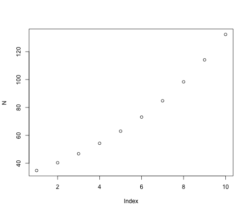
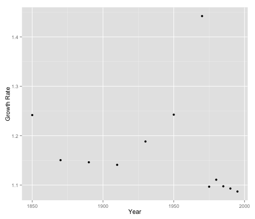
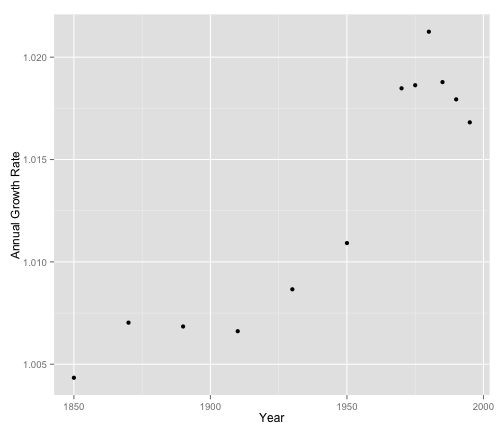

Population Ecology
========================================================


```r
N.t = 30
R = 1.16

N.t1 <- N.t * R
N.t1
```

```
[1] 34.8
```


You can also embed plots, for example:


```r
N <- c()
for (i in 1:10) {
    N[i] <- N.t * R^i
}

plot(N)
```

 


## Exercise Examples

1.1 Blue Whale Recovery

```r
N.1963 <- 10000
N.target <- 50000

R <- 1.1

t <- log(50000/10000)/log(R)
t
```

```
[1] 16.89
```

```r

R <- 1.02

t <- log(50000/10000)/log(R)
t
```

```
[1] 81.27
```

  
1.2 Human Population (1800 - 1995)  

```r
humans <- data.frame(Year = c(1800, 1850, 1870, 1890, 1910, 1930, 1950, 1970, 
    1975, 1980, 1985, 1990, 1995))
humans <- cbind(humans, Population = c(0.91, 1.13, 1.3, 1.49, 1.7, 2.02, 2.51, 
    3.62, 3.97, 4.41, 4.84, 5.29, 5.75))

Time.Interval <- c()
Time.Interval[1] <- NA
for (i in 2:length(humans$Year)) {
    Time.Interval[i] <- humans$Year[i] - humans$Year[i - 1]
}

Prev.Population <- humans$Population[1:(length(humans$Population) - 1)]

Growth.Rate <- humans$Population[2:length(humans$Population)]/Prev.Population

Annual.Growth.Rate <- Growth.Rate^(1/Time.Interval[2:length(Time.Interval)])

Table_1.3 <- cbind(humans, Time.Interval, Prev.Population = c(NA, Prev.Population), 
    Growth.Rate = c(NA, Growth.Rate), Annual.Growth.Rate = c(NA, Annual.Growth.Rate))
Table_1.3
```

```
   Year Population Time.Interval Prev.Population Growth.Rate
1  1800       0.91            NA              NA          NA
2  1850       1.13            50            0.91       1.242
3  1870       1.30            20            1.13       1.150
4  1890       1.49            20            1.30       1.146
5  1910       1.70            20            1.49       1.141
6  1930       2.02            20            1.70       1.188
7  1950       2.51            20            2.02       1.243
8  1970       3.62            20            2.51       1.442
9  1975       3.97             5            3.62       1.097
10 1980       4.41             5            3.97       1.111
11 1985       4.84             5            4.41       1.098
12 1990       5.29             5            4.84       1.093
13 1995       5.75             5            5.29       1.087
   Annual.Growth.Rate
1                  NA
2               1.004
3               1.007
4               1.007
5               1.007
6               1.009
7               1.011
8               1.018
9               1.019
10              1.021
11              1.019
12              1.018
13              1.017
```


Plot using Growth Rate  


```r
qplot(x = Table_1.3$Year[2:13], y = Table_1.3$Growth.Rate[2:13], xlab = "Year", 
    ylab = "Growth Rate")
```

 

  
Plot using the Annual Growth Rate  


```r
qplot(x = Table_1.3$Year[2:13], y = Table_1.3$Annual.Growth.Rate[2:13], xlab = "Year", 
    ylab = "Annual Growth Rate")
```

 


Compare the change in annual growth rate with the absolute increase in number of people


```r
Table_1.4 <- data.frame(Year = c(1975, 1985, 1995), Population.Size = c(3.97, 
    4.84, 5.75), Annual.Growth.Rate = c(1.01863, 1.018782, 1.016816))
Number.Added <- Table_1.4$Population.Size * (Table_1.4$Annual.Growth.Rate - 
    1)

Table_1.4 <- cbind(Table_1.4, Number.Added)

Table_1.4
```

```
  Year Population.Size Annual.Growth.Rate Number.Added
1 1975            3.97              1.019      0.07396
2 1985            4.84              1.019      0.09090
3 1995            5.75              1.017      0.09669
```


Calculate (based on the number added in 1995) the number added:   
 * per day:  

```r
per.day <- Table_1.4$Number.Added[3]/365
per.day
```

```
[1] 0.0002649
```

 * per hour:  

```r
per.hour <- per.day/24
per.hour
```

```
[1] 1.104e-05
```

 * per minute:

```r
per.minute = per.hour/60
per.minute
```

```
[1] 1.84e-07
```

  
1.3 Human Population (1995 - 2035)


```r
Table_1.5 <- data.frame(Year = c(1995, 2005, 2015, 2025, 2035))

fec <- 0.0273
R <- 1.016816
s <- R - fec

change10yr <- (R - 1)/4

R05 <- R - change10yr
R15 <- R05 - change10yr
R25 <- R15 - change10yr

Rs <- c(R, R05, R15, R25, 1)

fecs <- Rs - s

Rs10 <- Rs^10

Population <- 5.75
for (i in 2:5) {
    Population[i] <- Population[i - 1] * Rs10[i - 1]
}


Table_1.5 <- cbind(Table_1.5, Fecundity = fecs, R = Rs, R_10_yr = Rs10, Population = Population)
Table_1.5
```

```
  Year Fecundity     R R_10_yr Population
1 1995   0.02730 1.017   1.181      5.750
2 2005   0.02310 1.013   1.134      6.793
3 2015   0.01889 1.008   1.087      7.701
4 2025   0.01469 1.004   1.043      8.373
5 2035   0.01048 1.000   1.000      8.732
```


